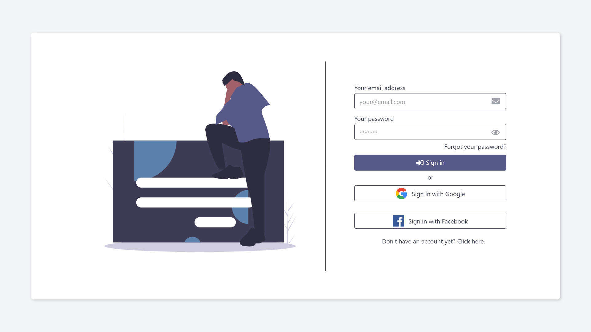
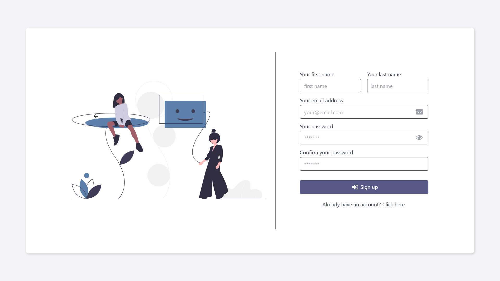
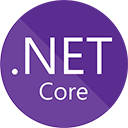
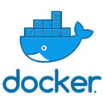
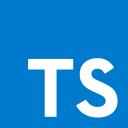

# Real time message app

  <a href="#computer-used-technologies">
    Used technologies
  </a>
  &nbsp;&nbsp;&nbsp;|&nbsp;&nbsp;&nbsp;
  <a href="#octocat-project-description">
    Project description
  </a>
  &nbsp;&nbsp;&nbsp;|&nbsp;&nbsp;&nbsp;
  <a href="#fire-contribute">
    Contribute
  </a>
  &nbsp;&nbsp;&nbsp;|&nbsp;&nbsp;&nbsp;
  <a href="#page_with_curl-license">
    License
  </a>

 
  

 

    

        <h4>Login screen</h4>
        
    

    

        <h4>Register screen</h4>
        
    

## :computer: Used Technologies

---

## :fire: Contribute

You can fork, help implement things, and create PR's.
Since the app have no name yet, why not start by helping get it a name? :sweat_smile:

---

## :octocat: Project Description

Still Writing it.

---

## :page_with_curl: License

That project is under MIT License, check the [LICENSE](LICENSE.md) file to read more.

---